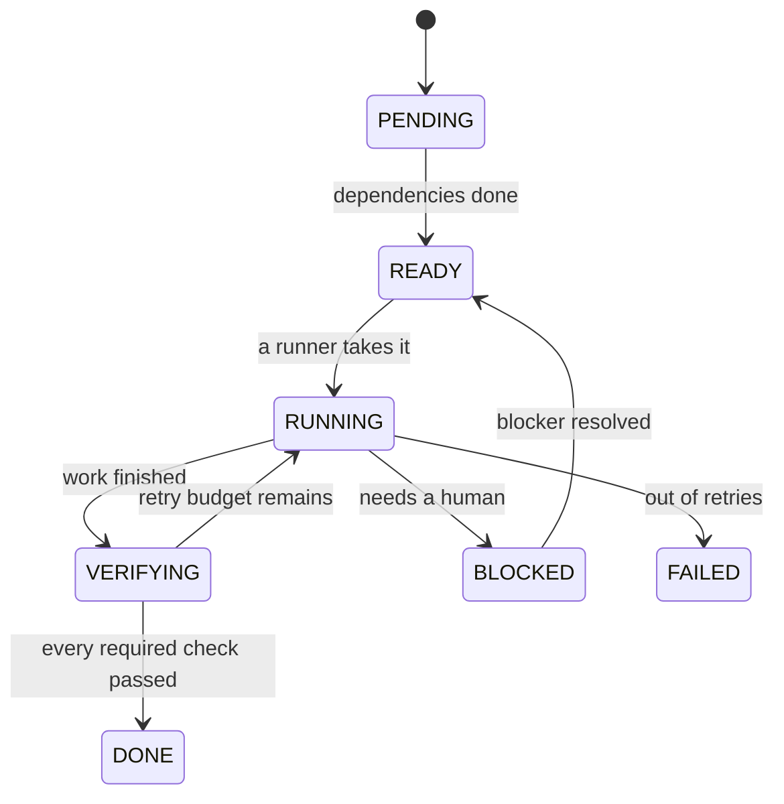

# Claude Away

**Go away. Come back to verified progress.**

[](docs/ROADMAP.md)
[](LICENSE)
[](https://code.claude.com/docs/en/plugins)

You pay for Claude every month. When you go on holiday for a week, that capacity quietly
expires — five-hour window after five-hour window, unused.

Claude Away is an open-source tool that turns those unused hours into **real, reviewable,
verified work** on your own repositories, while you are not there.

> [!IMPORTANT]
> **Pre-alpha.** The deterministic core that tracks and verifies work is built and tested.
> The part that actually runs Claude is not. You cannot leave this running for a week yet —
> see [What works today](#what-works-today).

---

## The idea

Most coding agents are built around a *task*. Claude Away is built around an **absence**.

Before you leave, you tell it three things:

- **how long** you will be gone,
- **which repositories** it may touch,
- **what you actually care about** — your goals, and your hard limits.

While you are gone, it works through a plan of small tasks, proves each one actually works
before calling it done, and adapts when reality turns out differently than planned.

When you get back, you get one briefing: what progressed, what is ready to review, what
failed, and what needs a decision from you. Not a thousand lines of log.

## The one rule that matters

> **`DONE` is a claim backed by evidence, not a sentence generated by Claude.**

This is the whole design. A model saying "all tests pass" proves nothing. A task in Claude
Away can only be marked complete when the checks it declared up front have actually run and
actually passed, in the current attempt, against the current definition of those checks.

If verification fails, the task does not become `DONE`. There is no override flag, and there
is deliberately no command that lets you — or a model — set a task's status by hand.



## It will not burn your quota for the sake of it

Claude Away is **not** "spend tokens because tokens exist". It is "convert capacity that
would otherwise expire into work you actually wanted".

- It never invents busywork to hit a usage number. (`noBusywork` is not even a setting you
  can turn off — it is fixed in the config schema.)
- It leaves headroom so a task can finish and save its state instead of dying at the
  rate-limit cliff.
- If it genuinely cannot justify useful work, it stops.
- It never scrapes credentials or undocumented endpoints. Everything is built on documented
  Claude Code surfaces.

## Safe by default

The goal is that you would genuinely be willing to leave it running. So the defaults are
conservative:

- only repositories you explicitly enrolled — nothing else is touched;
- each task works on its own branch, never directly on your default branch;
- no force pushes, ever;
- no merging into protected branches while you are away;
- no deployments and no destructive operations unless you explicitly allow them;
- no secrets copied into notes or logs;
- bounded retries, then an honest `BLOCKED` or `FAILED` — never an infinite loop;
- a full audit trail of what happened and why.

You should come home to tested pull requests, not to the discovery that an agent shipped to
production at 3am.

---

## What works today

Claude Away is being built from the state machine outward, because a flashy autonomous demo
without crash recovery is not a release.

**Built and tested** — the deterministic core (`awayctl`):

- versioned SQLite storage that survives crashes and restarts;
- the task lifecycle above, with transitions enforced by the database itself;
- the evidence gate, including protection against stale evidence from an earlier attempt or
  an edited check;
- task graph validation — dependencies, cycles, readiness;
- leases, so two runners can never work the same task at once;
- append-only evidence and audit history;
- the repository boundary: which repositories are enrolled, what state each one is in, and
  which operations policy would permit there;
- over 400 tests covering crash recovery, concurrency, replay and Git edge cases.

**Not built yet** — everything that changes a repository or runs a model:

- creating branches or worktrees, committing, pushing, opening pull requests;
- running Claude, running your test commands;
- the capacity-aware scheduler;
- the planner and the `/claude-away:*` commands;
- the long-running supervisor and the return briefing;
- Graphify and Obsidian integration.

Today `awayctl` can tell you that a repository is enrolled, clean, on its default branch and
safe to branch from — and then deliberately stops, because the part that would do the
branching is the next milestone.

See the [roadmap](docs/ROADMAP.md) and the [v0.1 plan](docs/V0_1_IMPLEMENTATION_PLAN.md)
for the order these arrive in.

## Try the core

Requires Python 3.10 or newer.

```bash
git clone https://github.com/xcrrr/claude-away
cd claude-away
pip install -e .

awayctl init                 # create the state database
awayctl status               # show the plan
awayctl doctor               # check the state for problems
awayctl gate AWAY-0001       # explain why a task can or cannot be completed

# read-only inspection of the repositories you enrolled
awayctl repos  --config examples/config.example.json
awayctl policy --config examples/config.example.json
```

Every command also takes `--json`, because an unattended supervisor should never have to
parse prose.

There is nothing to schedule yet — this is the foundation those features will sit on.

## What it will feel like

Once the executor lands, the whole interface is meant to be this small:

| Command | What it does |
| --- | --- |
| `/claude-away:init` | Pick your repos, then answer a few questions about your goals and limits |
| `/claude-away:plan` | Turn those goals into a task plan you can read before you leave |
| `/claude-away:start 8d` | Start an eight-day away window |
| `/claude-away:status` | See what is happening |
| `/claude-away:pause` / `:resume` | Stop and restart safely |
| `/claude-away:back` | Get your return briefing |

You should not have to understand schedulers, task graphs or database leases to go on
holiday. That complexity is the tool's job.

---

## Documentation

| Document | What is in it |
| --- | --- |
| [Product specification](docs/PRODUCT_SPEC.md) | What Claude Away is for, and what it refuses to do |
| [Architecture](docs/ARCHITECTURE.md) | How the pieces fit together |
| [State model](docs/STATE_MODEL.md) | The task lifecycle and evidence rules in full |
| [Second brain](docs/SECOND_BRAIN.md) | How long-term project memory is stored |
| [Roadmap](docs/ROADMAP.md) | Release plan |
| [v0.1 implementation plan](docs/V0_1_IMPLEMENTATION_PLAN.md) | Current build order and design decisions |
| [Contributing](CONTRIBUTING.md) | How to help |

## Contributing

Claude Away is being built in public, and the most useful contributions right now are not
features. They are the things that break autonomous systems: crash-recovery edge cases,
reproducible failures from real repositories, cross-platform scheduling problems, and
verification strategies that reduce false `DONE`s.

Read [CONTRIBUTING.md](CONTRIBUTING.md) first.

## License

[MIT](LICENSE)

---

Claude Away is an independent open-source project. It is not affiliated with or endorsed by
Anthropic. Claude and Claude Code are trademarks of Anthropic.
