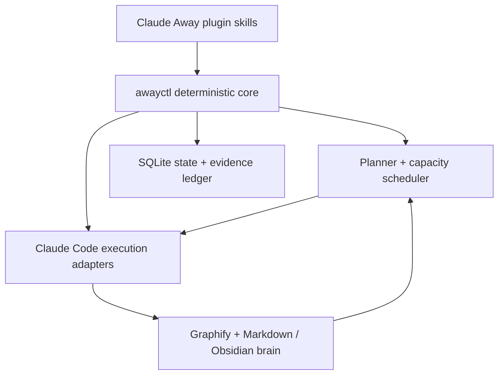
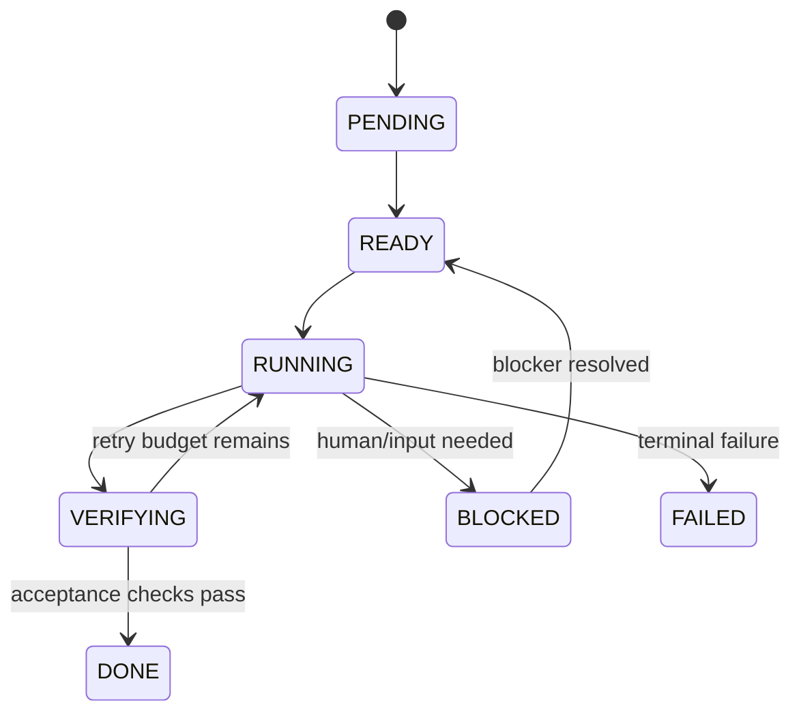

# Claude Away

**Go away. Come back to verified progress.**

[](docs/ROADMAP.md)
[](LICENSE)
[](https://code.claude.com/docs/en/plugins)

Claude Away is an open-source **capacity-aware autonomous work planner for Claude Code**. You tell it what you care about, which repositories it may touch, and how long you will be away. It builds a persistent understanding of your projects, turns your goals into a verifiable task graph, works through useful tasks while you are gone, records what it learns, and continuously replans as reality changes.

The goal is simple:

> **Turn Claude capacity that would otherwise expire into useful, reviewable, verified progress.**

Imagine you are leaving for the Dolomites for eight days. Your Claude Max limits will keep resetting while your laptop is in a backpack. Today, that capacity simply disappears. Claude Away is designed to make that absence a bounded autonomous work window instead.

> [!IMPORTANT]
> Claude Away is currently **pre-alpha**. This repository contains the product specification, architecture, state model, schemas, and Claude Code plugin manifest. The autonomous executor is the next milestone. Do not point the current project at production systems and expect it to work yet.

## The idea

Most coding agents are optimized for a task. Claude Away is optimized for an **absence**.

Before you leave, it should:

1. inventory only the repositories you explicitly select;
2. build structural project context, optionally with [Graphify](https://github.com/Graphify-Labs/graphify);
3. create a plain-Markdown second brain that works beautifully in Obsidian;
4. interview you about goals, priorities, boundaries, and what must wait for a human;
5. turn those goals into an ordered DAG of small tasks with explicit acceptance criteria;
6. estimate how to spread useful work across Claude's 5-hour and weekly capacity windows;
7. leave you with a plan you can inspect before autonomous work starts.

While you are away, it should:

1. select the highest-value ready task;
2. isolate the task in a branch/worktree;
3. use Claude Code workflows and subagents for work that benefits from them;
4. verify the result against deterministic acceptance criteria;
5. refuse to mark a task `DONE` when verification fails;
6. checkpoint code, evidence, decisions, failures, and new knowledge;
7. re-evaluate the plan after every meaningful result;
8. perform a full strategic replan every **84 hours (3.5 days)** by default;
9. carry unfinished tasks across a capacity reset instead of forgetting or restarting them;
10. generate another goal-aligned plan when the queue is genuinely exhausted.

When you come back, it should give you one concise return briefing: what changed, what passed, what failed, what is blocked, what needs your judgment, and which PRs are ready to review.

## Capacity-aware, not quota-burning

Claude Away is deliberately **not** a token burner and will never try to bypass Anthropic limits.

Claude Code exposes subscription usage for Pro/Max users through its documented status-line input: both the 5-hour and 7-day windows include `used_percentage` and `resets_at`. Claude Away's local runner will use that telemetry to pace useful work around real reset times.

The scheduler has two rules that matter more than hitting an exact percentage:

- Never start low-value busywork solely to consume capacity.
- Keep enough configurable headroom to finish and checkpoint the current task instead of dying at the rate-limit cliff.

The proposed defaults are a **95% 5-hour soft target** and a **97% weekly soft target**. They are configuration, not hard-coded policy. If valuable work remains, users can choose a more aggressive target.

If the useful queue is empty, Claude Away asks the planner for the next set of tasks derived from declared goals and recorded project state. If it cannot justify useful work, it stops.

## How it fits together



Claude is responsible for judgment: understanding code, proposing plans, implementing changes, reviewing, and explaining what was learned.

`awayctl` is responsible for facts: task states, locks, dependencies, timestamps, reset windows, retry budgets, verification evidence, checkpoints, and what is allowed to happen without a human.

That separation is intentional. The model does not get to rewrite history because it feels a task is probably finished.

## `DONE` means evidence exists

The core lifecycle is deliberately boring:



Claude Code's documented `TaskCompleted` hook can block task completion and feed failed verification back to the model. Claude Away will use that as one enforcement layer, backed by its own evidence ledger. `StopFailure` separately exposes `rate_limit` and other API failure types so interrupted runs can be checkpointed instead of silently disappearing.

## Planned commands

The public plugin interface is intentionally small:

| Command | Purpose |
| --- | --- |
| `/claude-away:init` | Select repos, create the brain, inspect projects, and interview the user |
| `/claude-away:plan` | Create or rebuild the goal-driven task DAG |
| `/claude-away:start 8d` | Start an away window with explicit duration and safety policy |
| `/claude-away:status` | Show capacity, active task, queue, blockers, and recent evidence |
| `/claude-away:pause` | Stop launching new work and checkpoint the active run |
| `/claude-away:resume` | Continue safely from persisted state |
| `/claude-away:back` | End away mode and generate the return briefing |

The commands are the UX. They are **not** the state store.

## Two execution modes

| | Local Autopilot | Cloud Away Mode |
| --- | --- | --- |
| Laptop | Must stay on | Can be closed |
| Execution | Claude Code CLI / Agent SDK | Claude Code Routines |
| Exact local quota telemetry | Yes, via documented status-line input | Not assumed until Anthropic exposes an equivalent documented routine surface |
| Repositories | Local repos / worktrees | GitHub repos attached to the routine |
| Scheduling | Claude Away scheduler | Official routine triggers + Claude Away plan |
| Recovery | Checkpoint + resume | Fresh cloud runs + persisted repo/brain state |

Cloud Routines are currently a research preview. Claude Away will treat their API as an adapter, not bake preview behavior into the core state machine.

## Ultracode and agents

Claude Away will use agents aggressively **when the task benefits from parallelism**, but it will not confuse “more agents” with “better work.”

Current Claude Code behavior matters here:

- `claude --effort ultracode` enables xhigh reasoning plus automatic workflow orchestration for a local session.
- A substantive request can become separate understand → implement → verify workflows.
- The literal `ultracode` prompt trigger only opts in for human-origin prompts. It does **not** activate a workflow from `-p`, scheduled tasks, webhooks, or relayed comments.

So unattended Claude Away work will invoke saved workflows explicitly or launch sessions with the appropriate effort setting. It will not rely on a magic keyword in a scheduled prompt.

## The second brain

Graphify and Obsidian solve different problems, so Claude Away uses them as complementary layers rather than dumping an entire source tree into Markdown.

```text
.claude-away/brain/
├── Goals.md
├── Master Plan.md
├── Decisions.md
├── Blockers.md
├── Return Briefing.md
├── Projects/
│   └── <repo>/
│       ├── Overview.md
│       ├── Architecture.md
│       ├── Current State.md
│       └── Learnings.md
├── Tasks/
│   └── AWAY-0001.md
└── Runs/
    └── <run-id>.md
```

- **Graphify** provides a structural map of code and relationships and can update incrementally.
- **The brain** preserves semantic context: goals, decisions, lessons, blockers, task evidence, and why the future plan changed.
- **SQLite** remains the authoritative machine state. Markdown is human-readable memory, not a transactional database.

See [Second Brain](docs/SECOND_BRAIN.md) for the rules.

## Safety defaults

Unattended coding should be boringly safe.

Claude Away is being designed around these defaults:

- only explicitly enrolled repositories;
- one isolated branch/worktree per task where practical;
- no force pushes;
- no merges to protected/default branches while the user is away;
- no production deployments by default;
- no destructive filesystem/database operations without an explicit policy grant;
- no scraping OAuth credentials or undocumented private usage endpoints;
- no secret values in the second brain;
- deterministic verification before `DONE`;
- bounded retries, then `BLOCKED` or `FAILED` rather than infinite loops;
- auditable run/evidence logs and a human review queue.

The objective is to come home to tested PRs, **not** to discover that an autonomous agent shipped to production at 03:17.

## Repository architecture

```text
claude-away/
├── .claude-plugin/plugin.json       # Claude Code plugin metadata
├── skills/                          # /claude-away:* user interface
│   ├── init/SKILL.md
│   ├── plan/SKILL.md
│   ├── start/SKILL.md
│   ├── status/SKILL.md
│   ├── pause/SKILL.md
│   ├── resume/SKILL.md
│   └── back/SKILL.md
├── workflows/                       # reusable Claude Code dynamic workflows
│   ├── inventory.js
│   ├── execute-task.js
│   ├── verify-task.js
│   └── replan.js
├── hooks/hooks.json                 # completion/failure checkpoints
├── bin/awayctl                      # deterministic controller entrypoint
├── src/claude_away/
│   ├── core/                        # state machine, DAG, scheduler, policies
│   ├── adapters/                    # Claude, Git, Graphify, Obsidian, Routines
│   ├── runners/                     # local and cloud execution
│   └── cli/                         # awayctl commands
├── schemas/                         # stable config/task/run contracts
├── tests/                           # unit, integration, crash/recovery, evals
├── docs/                            # product and architecture docs
└── examples/                        # safe example configurations
```

The deterministic core is planned in Python because the standard library gives us SQLite, subprocess control, locking primitives, and portable filesystem tooling, while Graphify already targets Python 3.10+. Claude dynamic workflows remain JavaScript because that is Claude Code's native workflow format.

## Roadmap

The first useful release is intentionally narrower than the final vision:

**v0.1 — Local Away MVP**

- one or more explicitly enrolled local repos;
- goal interview and plan DAG;
- persistent SQLite task state;
- branch/worktree isolation;
- exact local 5h/7d capacity ingestion;
- Claude execution + deterministic verification;
- checkpoint/retry/rate-limit recovery;
- pause/resume/back;
- return briefing;
- tests for crashes and duplicate execution.

Then we add Graphify/Obsidian memory, multi-repo dependency planning, 84-hour strategic replanning, and Cloud Routines. See the full [roadmap](docs/ROADMAP.md).

## Design docs

- [Product specification](docs/PRODUCT_SPEC.md)
- [Architecture](docs/ARCHITECTURE.md)
- [State model](docs/STATE_MODEL.md)
- [Second brain](docs/SECOND_BRAIN.md)
- [Roadmap](docs/ROADMAP.md)
- [Contributing](CONTRIBUTING.md)

## Built on documented surfaces

Claude Away intentionally avoids private Claude account APIs. The architecture is based on public Claude Code capabilities:

- [Claude Code plugins](https://code.claude.com/docs/en/plugins-reference)
- [Dynamic workflows and Ultracode](https://code.claude.com/docs/en/workflows)
- [Hooks](https://code.claude.com/docs/en/hooks)
- [Goals](https://code.claude.com/docs/en/goal)
- [Subscription rate-limit telemetry](https://code.claude.com/docs/en/statusline)
- [Cloud Routines](https://code.claude.com/docs/en/routines)
- [Programmatic Claude Code / Agent SDK](https://code.claude.com/docs/en/headless)
- [Graphify](https://github.com/Graphify-Labs/graphify)

## Contributing

Claude Away is being built in public. The best contributions right now are architecture challenges, reproducible failure cases, cross-platform scheduling ideas, Claude Code plugin expertise, and tests for the situations autonomous systems usually get wrong.

Read [CONTRIBUTING.md](CONTRIBUTING.md) before opening a PR.

## License

[MIT](LICENSE)

---

Claude Away is an independent open-source project and is not affiliated with or endorsed by Anthropic. Claude and Claude Code are trademarks of Anthropic.
