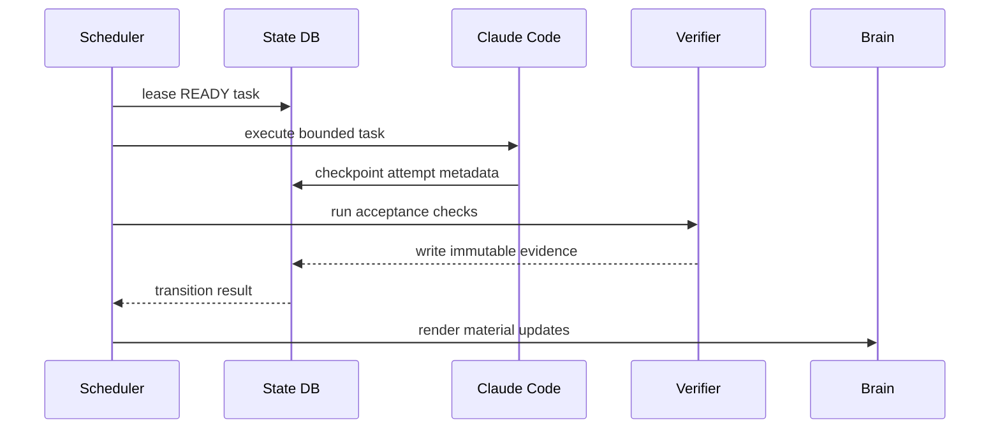

# Architecture

## Architectural thesis

Claude Away should not be one long prompt controlling itself.

The system separates **probabilistic judgment** from **deterministic orchestration**:

- Claude understands repositories, proposes tasks, implements changes, critiques work, and summarizes discoveries.
- `awayctl` owns state, scheduling, locks, policies, capacity telemetry, subprocess lifecycle, evidence, and recovery.
- Git owns code history.
- verification commands and CI own executable proof.
- SQLite owns machine state.
- Markdown/Obsidian owns human-readable long-term memory.
- Graphify optionally owns structural code knowledge.

## Components

### Claude Code plugin

The installable UX surface. It will ship:

- concise skills for `init`, `plan`, `start`, `status`, `pause`, `resume`, and `back`;
- saved dynamic workflows for inventory, implementation, verification, and strategic replanning;
- hooks for completion enforcement and failure/checkpoint recording;
- the `awayctl` executable on Claude Code's plugin `bin/` path once packaging is finalized.

Plugin skills remain thin. They call deterministic operations and give Claude only the decision context it needs.

### `awayctl` core

The controller is planned as Python 3.10+ with a small dependency surface.

Responsibilities:

- configuration validation;
- SQLite schema/migrations;
- task DAG validation and readiness;
- state transitions;
- leases/locks and idempotency keys;
- policy checks;
- capacity-window ingestion and scheduling;
- local process supervision;
- verification execution;
- evidence persistence;
- brain rendering;
- recovery after crashes/rate limits.

### Planner

The planner is an LLM-backed service with deterministic input/output contracts.

Input:

- user goals;
- current task DAG;
- project summaries;
- Graphify structural report when available;
- decisions/blockers/learnings;
- capacity horizon;
- policy constraints.

Output is validated against a schema before it can mutate state. A planner cannot directly mark tasks `DONE`.

### Execution runner

Each run binds one task attempt to:

- a repo revision;
- a branch/worktree;
- a Claude session/run ID;
- selected workflow/effort;
- start/end timestamps;
- artifacts and verification evidence.

The local runner can use Claude Code non-interactive mode / Agent SDK and launch suitable sessions with Ultracode enabled. The cloud adapter will use official Routines rather than simulating a cloud scheduler with local OAuth credentials.

### Capacity provider

A provider interface keeps capacity acquisition out of scheduling logic.

Initial providers:

1. `statusline`: ingest documented `five_hour` and `seven_day` Claude.ai subscription fields from local Claude Code.
2. `failure-only`: when exact telemetry is unavailable, learn only from successful runs and documented `rate_limit` failures and schedule conservatively.

Future providers must use documented interfaces. An adapter that scrapes a private OAuth endpoint will not be accepted.

### Second brain

The brain is a projection over authoritative state plus curated semantic summaries. See [SECOND_BRAIN.md](SECOND_BRAIN.md).

## Local execution flow



The process must tolerate a crash between any two arrows.

## Capacity scheduling

Scheduling uses current goal value, readiness, estimated effort, risk, and available capacity.

A useful first scoring shape is:

```text
score = goal_value * unblock_factor * confidence / (estimated_effort * risk_penalty)
```

This is a heuristic, not a product promise. The important invariants are:

- never schedule a task whose dependencies are incomplete;
- never exceed policy boundaries to save capacity;
- prefer a task that can plausibly checkpoint before the next capacity boundary;
- do not launch a new task inside the configured reserve;
- do not manufacture low-value tasks to hit a usage target.

## Replanning levels

### Micro-replan

Runs after `DONE`, `BLOCKED`, `FAILED`, or a material discovery. It updates only affected priorities/dependencies and records why.

### Strategic replan

Runs every 84 hours by default, after a weekly reset, or when the planner detects that a major goal assumption is invalid.

It re-reads goals, brain state, completed evidence, blockers, and current project structure before proposing a revised DAG.

## Isolation

Default execution policy:

1. refuse to run against an unexpectedly dirty worktree;
2. resolve the expected base commit;
3. create `claude-away/<task-id>-<slug>`;
4. use a worktree where parallelism or repository safety warrants it;
5. commit bounded changes;
6. verify from the resulting revision;
7. optionally push/open a PR if the user's policy permits it;
8. never merge protected/default branches while away by default.

## Crash recovery

Every externally visible step must be idempotent or protected by an idempotency key.

Examples:

- task attempts have stable attempt IDs;
- branch creation records its expected base;
- verification evidence is append-only;
- a lease expires and can be recovered after process death;
- resuming checks Git state before sending another model request;
- a task with recorded successful evidence cannot silently return to `RUNNING`.

## Cloud mode

Claude Code Routines can run on Anthropic-managed infrastructure when the laptop is closed. They are currently a research preview, so cloud integration is intentionally an adapter.

Important differences from local mode:

- each run starts in a fresh cloud environment;
- repos must be available through the routine's GitHub configuration;
- user-local personal skills do not automatically exist there;
- exact status-line quota telemetry is not assumed to be available to a Routine;
- persistent plan/brain state must live somewhere the fresh run can retrieve safely (initially a dedicated repo branch/artifact strategy, later a pluggable state backend).

Cloud mode must degrade honestly when it cannot know remaining subscription capacity exactly.

## Planned repository tree

```text
.
├── .claude-plugin/
│   └── plugin.json
├── skills/
│   ├── init/SKILL.md
│   ├── plan/SKILL.md
│   ├── start/SKILL.md
│   ├── status/SKILL.md
│   ├── pause/SKILL.md
│   ├── resume/SKILL.md
│   └── back/SKILL.md
├── workflows/
│   ├── inventory.js
│   ├── execute-task.js
│   ├── verify-task.js
│   └── replan.js
├── hooks/
│   └── hooks.json
├── bin/
│   └── awayctl
├── src/claude_away/
│   ├── core/
│   │   ├── state.py
│   │   ├── dag.py
│   │   ├── scheduler.py
│   │   ├── capacity.py
│   │   ├── policy.py
│   │   └── evidence.py
│   ├── adapters/
│   │   ├── claude.py
│   │   ├── git.py
│   │   ├── graphify.py
│   │   ├── obsidian.py
│   │   └── routines.py
│   ├── runners/
│   │   ├── local.py
│   │   └── cloud.py
│   └── cli/
├── schemas/
│   ├── config.schema.json
│   └── task.schema.json
├── tests/
│   ├── unit/
│   ├── integration/
│   ├── recovery/
│   └── evals/
├── examples/
└── docs/
```

Directories are added when their first implementation exists; the repository does not keep empty placeholder folders.

## Current Claude Code assumptions

The architecture is based on documented behavior as of August 2026:

- plugin components live at the plugin root; only `plugin.json` belongs under `.claude-plugin/`;
- plugin workflows live in `workflows/`;
- `TaskCompleted` hooks can block completion with exit code 2;
- `StopFailure` exposes `rate_limit` and related API errors;
- Pro/Max status-line data exposes 5-hour and 7-day usage/reset values after the first response;
- Ultracode prompt-keyword opt-in does not trigger from `-p` or scheduled prompts;
- Cloud Routines are a research preview.

These are adapter assumptions, not core-domain assumptions, so upstream changes should require small compatibility patches rather than a rewrite.
